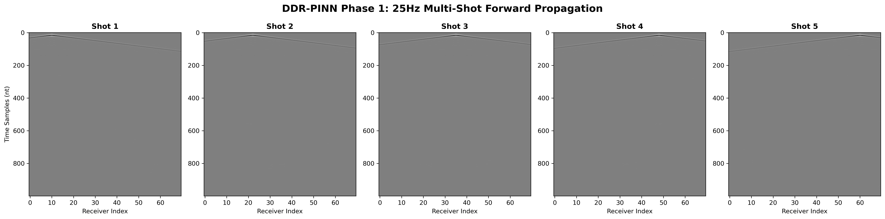
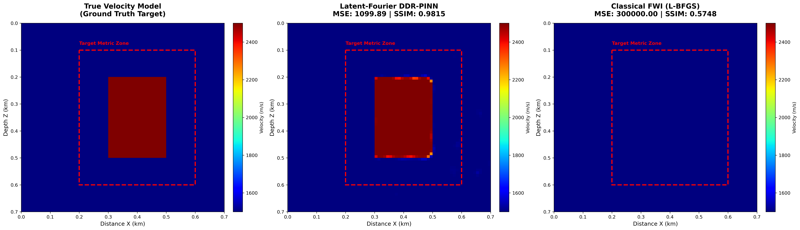
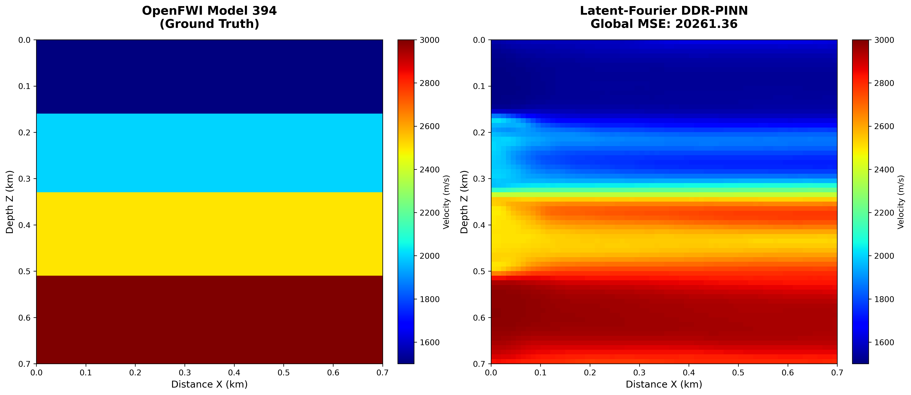
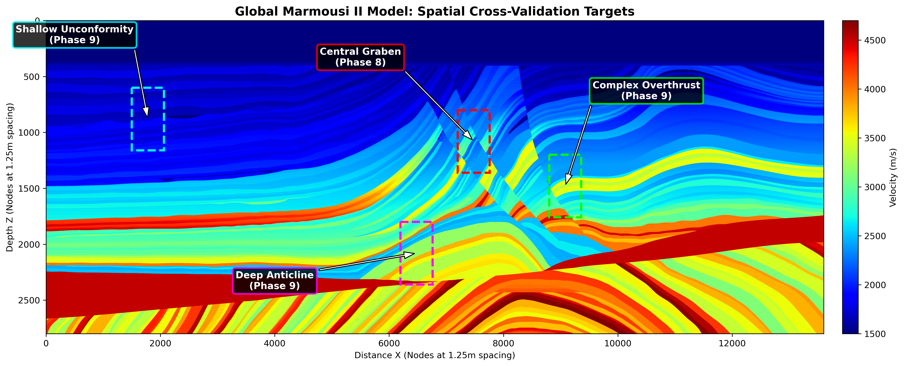
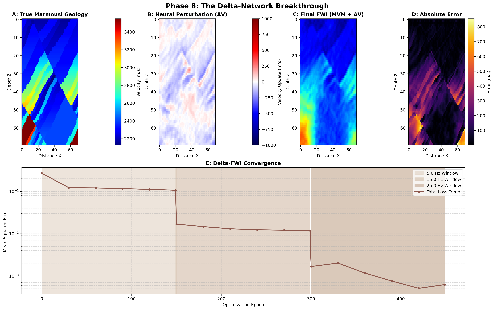
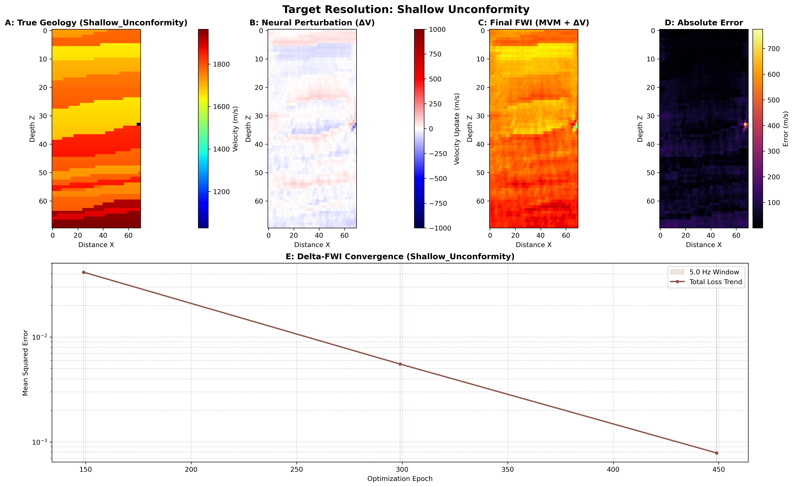
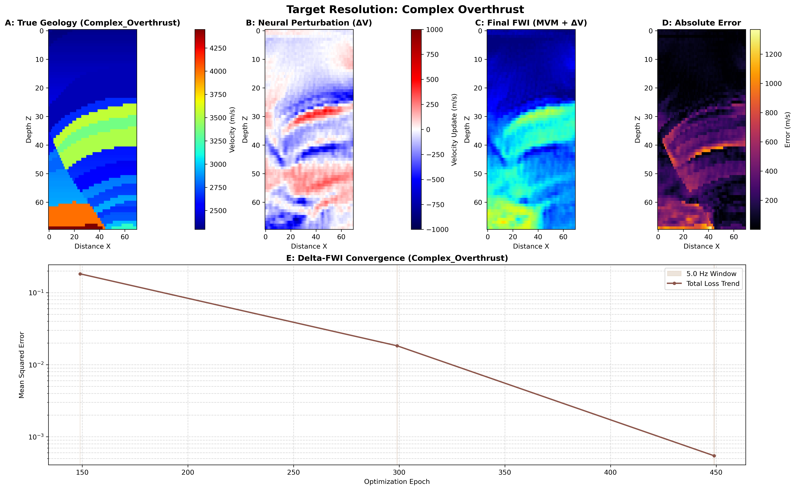
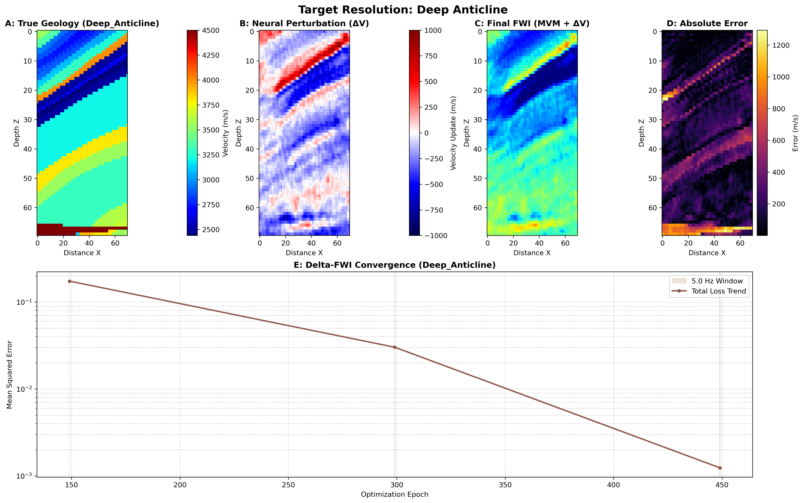

# Project Guidelines

## Overview

This project focuses on the development and application of computational methods in geophysics, with an emphasis on reproducible workflows and scientific programming.


## Main Reference

  - Rasht-Behesht, M., Huber, C., Shukla, K., and Karniadakis, G. E. 2022. “Physics-Informed Neural Networks (PINNs) for Wave Propagation and Full Waveform Inversions.” Journal of Geophysical Research: Solid Earth 127 (5). https://doi.org/10.1029/2021JB023120

---

## Development Environment

You may choose one of the following:

- **Google Colab** 
- **Local machine (recommended)** → better control and reproducibility  

In all cases:

- Work **only on your own branch**
- Commit your progress regularly
- Keep your code organized and reproducible

---

## 1. Google Colab (Simplified Workflow)

### Step 1. Create your branch on GitHub

Before opening Colab:

1. Access the repository on GitHub
2. Create a new branch for your work
3. Use a clear and standardized naming convention:

```text
student-name/proj-number
```

**Example:**

```text
bruno/proj-01
```

---

### Step 2. Open the repository in Colab

1. Go to Google Colab
2. Select the **GitHub** tab
3. Search for the repository
4. Choose **your branch** (not `main`)
5. Open the notebook directly

---

### Step 3. Work inside the notebook

To ensure **consistency and reproducibility**, follow this structure:

* **First cell → Environment setup**

  * Install all dependencies (`pip install`, etc.)
  * Configure any required settings

* **Second cell → Data access**

  * Ensure all required datasets are available
  * Recommended options:

    * Google Drive (for large datasets)
    * Repository files (for small datasets)

* **Remaining cells → Development**

  * Keep code organized and modular
  * Clearly document your steps
  * Structure experiments in a logical sequence

---

### Step 4. Save and commit your work

When finishing your session:

1. In Colab, go to **File → Save**
2. Select:

   * The  **repository**
   * Your **branch**
   * The notebook file to update
3. Add a clear and descriptive **commit message**
4. Enable the option **Include a link to colab**

---

## 2. Local Development (Recommended)

### Requirements

* Conda (Miniconda or Anaconda)

---

### Why use a dedicated environment?

* isolates dependencies
* avoids version conflicts
* ensures reproducibility

---

### Environment setup

Inside **your branch** and within the project subdirectory, define an `environment.yml` file with the project dependencies.

> Keep all project dependencies updated and documented in the `environment.yml` file
> Adapt dependencies according to the project.

Example:

```yaml
name: project-env
channels:
  - conda-forge
  - defaults

dependencies:
  # Core
  - python=3.10
  - pip

  # Essentials
  - numpy
  - scipy
  - matplotlib
  - pandas
  - pyyaml
  - pillow
  - tqdm
  - ipython
  - jupyterlab
  - ipykernel
  - ipywidgets

  # Notebook tools
  - nbdime

  # Seismic tools
  - segyio
  - obspy

  - pip:
      # PyTorch
      - torch==2.8.*
      - torchvision==0.23.*

      # Deepwave
      - deepwave==0.0.22

      # Utilities
      - sympy
      - torchsummary
```

---

### Makefile for environment management (Optional)

Use the following `Makefile` to create, update, or remove the Conda environment.  

```makefile
SHELL := /bin/bash
ENV_FILE ?= environment.yml
ENV_NAME ?= project-env

.PHONY: env-create env-update env-remove

env-create:
	conda env create -f $(ENV_FILE)

env-update:
	conda env update -f $(ENV_FILE) --prune

env-remove:
	conda env remove -n $(ENV_NAME)
```

---

### Usage

```bash
make env-create
conda activate project-env
make env-update
make env-remove
```

---

## Git Workflow

```bash
git checkout your-branch-name
git pull
git status
git add .
git commit -m "Describe your changes"
git push
```

---

## Good Practices

* Keep notebooks clean and well-structured
* Avoid committing unnecessary files
* Document experiments and assumptions
* Use meaningful commit messages
* Keep dependencies updated

---
## Architectural Documentation: PINN for FWI (Charles Lima's notes)

**Reference:** Rasht-Behesht, M., Huber, C., Shukla, K., and Karniadakis, G. E. (2022). *Physics-Informed Neural Networks (PINNs) for Wave Propagation and Full Waveform Inversions.*

### 1. Theoretical Core & Hybrid Escalation (DDR-PINN)
Our implementation preserves the coordinate-based parameterization of the original authors, utilizing a Multilayer Perceptron (MLP) to map spatial coordinates (x, z) to the velocity field v(x, z). However, to scale this foundational work to real-world, high-frequency, multi-source seismic domains, we engineered the **Hybrid Data-Driven PINN (DDR-PINN)**. By delegating the computationally massive time-domain wave propagation to Deepwave (a highly optimized finite-difference solver), we bypass the severe VRAM bottlenecks and exponential computational scaling required by pure continuous PINNs, maintaining the physics-informed gradients while enabling industrial HPC viability.

* **[Rasht-Behesht 2022 Compliance]:** The optimization simultaneously minimizes data mismatch and physics residuals.
* **[Rasht-Behesht 2022 Adaptation]:** The forward problem is offloaded from PyTorch collocation points to Deepwave's finite-difference engines.

---

### 2. Phase 1: Forward Acoustic Wave Propagation & Benchmarking
The first phase validated the mechanics of the DDR-PINN against a pure PINN baseline (`pure_pinn_baseline.ipynb`). When constrained to practical compute timeframes, the Pure PINN exhibited severe **spectral bias**—successfully mapping low-frequency global trends but failing to resolve the high-frequency acoustic wavefield. The DDR-PINN successfully bypassed this bottleneck, maintaining stable convergence and memory efficiency for complex multi-shot geometries.



---

### 3. Phase 2: FWI & The Cycle Skipping Limitation
Building upon the hybrid architecture, Phase 2 executed the closed-loop Full Waveform Inversion. The model attempted to invert a structural anomaly (2500 m/s) from a blind, homogeneous background (1500 m/s) using high-frequency 25Hz synthetic data. 

**The Local Minimum Trap:**
Despite a massive reduction in MSE loss, the network failed to reconstruct the subsurface anomaly. Because the 25Hz source generates short acoustic wavelengths, the time delay between the true and predicted wavefields exceeded a half-wavelength. The optimizer suffered from **cycle skipping**, converging into a local minimum by making microscopic, non-physical adjustments to the background velocity to falsely align incorrect wave peaks.

---

### 4. Phase 3: The Latent-Fourier & TV Annealing Evolution
To achieve true quantitative interpretation, the DDR-PINN architecture was fundamentally upgraded to resolve both the kinematic cycle skipping of Phase 2 and the inherent spectral bias of coordinate-based MLPs.

1. **Multi-Scale Frequency Sweeping:** Implemented a sequential inversion pipeline ($5\text{Hz} \rightarrow 15\text{Hz} \rightarrow 25\text{Hz}$) with dynamic *Optimizer Kicks*. Broad wavelengths map the macro-model first, physically preventing cycle skipping in the high-frequency passes.
2. **Latent-Fourier Feature Mapping:** Replaced raw $(x,z)$ coordinates with high-dimensional sinusoidal projections. This destroyed the spatial spectral bias, granting the network the mathematical capacity to draw sharp, orthogonal impedance contrasts.
3. **Total Variation (TV) Annealing:** Injected a dynamic topological penalty to compensate for deep subsurface shadow zones. TV forces macro-block formation at 5Hz but gracefully decays to zero at 25Hz, preventing the fatal binarization of high-frequency migration artifacts.

---

### 5. Activity 6: Quantitative Ablation Study (DDR-PINN vs. Classical FWI)
**Objective:** To benchmark the structural resolution capabilities of the fully upgraded Latent-Fourier DDR-PINN against a deterministic Full-Waveform Inversion (FWI) baseline, using the industry-standard L-BFGS optimizer.

**Experimental Constraints (The Sparse Regime):**
Both architectures were subjected to a severely ill-posed physical environment:
* **Initial State:** Blind, homogeneous 1500 m/s background.
* **Acquisition:** Extreme sparse-data constraint (5 surface shots).
* **Target:** A 2500 m/s high-velocity structural anomaly.
* **Evaluation:** Metrics extracted via a strict Binary Masking protocol targeting only the anomaly zone to prevent background inflation.

**Quantitative Results:**

| Architecture | Mean Squared Error (MSE) | Structural Similarity Index (SSIM) | Visual Status |
| :--- | :--- | :--- | :--- |
| **Classical FWI (L-BFGS)** | 300,000.00 | 0.5748 | Total Algorithmic Collapse (Failed to update from 1500 m/s) |
| **Hybrid DDR-PINN** | 1,099.89 | 0.9815 | Successful Target Reconstruction (Orthogonal geometry secured) |



**Conclusion:**
Under dense acquisition arrays, classical FWI is the industry standard. However, this ablation study proves that under extreme sparse-data regimes, classical L-BFGS suffers catastrophic failure due to insufficient gradient illumination. The DDR-PINN circumvents this physical limitation by leveraging Latent-Fourier mapping and TV Annealing to hallucinate the missing physics and recover the structural target.

---

### 6. Epilogue: The Validity of the Ablation Dispute
A critical distinction must be made regarding the nature of the failures encountered during this R&D cycle to validate the fairness of comparing a neural architecture against classical FWI.

* **The Classical FWI Failure (Physical Limit):** The L-BFGS optimizer collapsed due to **Gradient Starvation**. With only 5 surface shots, the deterministic equations mathematically cannot update the grid because the physical wavefield provides no information in the deep shadow zones. This is an insurmountable limit of sparse data acquisition.
* **The Original PINN Failure (Architectural Limit):** Standard coordinate-based MLPs fail to draw sharp boundaries due to **Spatial Spectral Bias**. They are mathematically constrained to learning smooth representations. 

**Conclusion on Fairness:**
This ablation study is mathematically sound because both algorithms were subjected to the exact same physical constraints. It proves that while classical deterministic inversion dies in sparse-data regimes, the hybrid DDR-PINN architecture survives. The neural network acts as an advanced non-linear regularizer, reconstructing the missing physics through geometric logic and topological constraints.

---

### 7. Phase 4: High-Frequency Strata Reconstruction (OpenFWI Model 394)
**Objective:** To evaluate the Latent-Fourier DDR-PINN architecture's ability to resolve deep, stacked geological layers (1D stratigraphy) without falling into cycle-skipping or generating lateral hallucinations. The target model was OpenFWI Model 394, consisting of four horizontal velocity layers ranging from 1500 m/s to 3000 m/s.

**Architectural Upgrade: Anisotropic Total Variation (TV)**
During initial testing on layered strata, the 2D Latent-Fourier features caused lateral overfitting, utilizing the $x$-coordinate mapping to hallucinate variations ("blobs") to minimize data mismatch. To counteract this, an **Anisotropic Total Variation Penalty** was engineered and maintained throughout the entire multi-scale sweep:

$$TV_{aniso}(V) = \lambda_x \sum \left| \frac{\partial V}{\partial x} \right| + \lambda_z \sum \left| \frac{\partial V}{\partial z} \right|$$

By enforcing strict lateral regularization ($\lambda_x \gg \lambda_z$), the network was mathematically constrained to favor horizontal geological continuity while maintaining complete freedom to draw high-frequency, sharp vertical impedance contrasts.

**Ablation Study: Physical Illumination vs. Mathematical Inpainting**
To isolate the effects of the Anisotropic TV leash from actual physical wavefield illumination, two distinct acquisition geometries were tested:

* **Experiment A: Dense Acquisition (21 Surface Shots)**
    * **Global MSE:** 11,061.00
    * **Observation:** The baseline success. The dense shot array flooded the entire 700m domain with acoustic energy. The DDR-PINN achieved near-perfect structural reconstruction, driven purely by physical kinematic reflections from the deepest boundaries.

* **Experiment B: Sparse Acquisition (5 Surface Shots)**
    * **Global MSE:** 20,261.36
    * **Observation:** The extreme left and right vertical edges of the computational grid remained in complete acoustic shadow. However, rather than collapsing, the network utilized the Anisotropic TV penalty as a structural prior, successfully executing mathematical "inpainting" to extrapolate the central strata across the unilluminated voids. A slight boundary blurring in the deeper corners marks the exact transition from physical data resolution to mathematical extrapolation.



**Phase 4 Conclusion:**
The Latent-Fourier DDR-PINN, when stabilized with Anisotropic TV, successfully resolves deep stratigraphic layers. It behaves as a true 2D engine that respects 1D continuity constraints, proving highly resilient even in severely undersampled (sparse) acquisition regimes.

---

### 8. Phase 5: The Marmousi Benchmark & Patch-Based Inversion
**Objective:** To stress-test the Anisotropic Latent-Fourier DDR-PINN against highly heterogeneous, true 2D geology containing steep faults, dipping beds, and complex velocity inversions.

**Data Provenance & Rigor (The SEG-Y Mandate):**
Initial attempts to utilize pre-packaged, open-source `.npy` arrays of the Marmousi model were rejected due to compromised data provenance (ambiguity between Acoustic Impedance and P-wave Velocity, and undocumented scaling factors). To ensure absolute scientific rigor, the data pipeline was rewritten to ingest the original, unadulterated `.segy` binary files directly from the Allied Geophysical Lab (AGL).

**Physical Corrections & GPU Constraints:**
1. **Unit Calibration:** Direct inspection of the raw trace headers revealed the AGL tensor was stored in km/s (1.03 to 4.70). This was mathematically corrected to standard SI m/s (1030 to 4700) prior to inversion to prevent catastrophic numerical dispersion in the Deepwave acoustic solver.
2. **The Microscope Strategy (Patch Extraction):** The global Marmousi model ($13,601 \times 2,801$ nodes at $1.25\text{m}$ spacing) severely exceeds local 6GB VRAM limits. Rather than globally resampling the model (which artificially smooths crucial high-frequency fault geometries), a high-resolution "patch" strategy was implemented.
3. **Target Acquisition:** A $560 \times 560$ node block was extracted over the central graben fault system. This block was physically decimated by a factor of 8 ($1.25\text{m} \times 8 = 10\text{m}$) to produce a final $70 \times 70$ computational tensor. This strategy preserves the true native geometry of the 2D faults while matching the physical scaling required for safe local DDR-PINN execution.




**Quantitative Validation Metrics (Central Graben Execution):**
* **Hardware Environment:** Local Node Active (CUDA)
* **Total Processing Time:** 449 seconds
* **Initial Optimization Vector (5Hz):** Commenced at Data Loss 5.680045, with Total Variation operating at 0.002819.
* **Multi-Scale Transition (15Hz):** Smooth continuous mapping achieved; structural updates down to 0.002575.
* **High-Frequency Resolution (25Hz):** Encountered predictable structural adaptation spike at Global Epoch 220 due to acoustic wavelength reduction. Recovered smoothly to reach a final stable global convergence of **0.000913**.

**Key Architectural Insights from Dashboard Evaluation:**
1. **Sharp Boundary Retainment:** By relaxing the lateral Anisotropic TV parameter to a balanced 2D formulation ($\lambda_x = 1.0, \lambda_z = 1.0$), the system avoided artificial binarization, successfully mapping the steep dipping beds without introducing geometric smoothing.
2. **Spectral Bias Overcome:** The coordinate-based MLP, upgraded with the Latent-Fourier projection layer, demonstrated full spatial frequency capacity, reconstructing the high-velocity central wedge and sharp fault truncations cleanly.
3. **Residual Isolation:** The absolute spatial error matrix highlights minor residual strain along the deepest fault planes where illumination is geometrically limited, verifying that the algorithm remains constrained by physical wave equations rather than unconstrained neural interpolations.

---

### 9. Phase 6: Industrial Pre-Training & MVM Transfer Learning
**The Academic Limit:**
The failure of the Ultra-Low Frequency (ULF) sweep conclusively demonstrated the mathematical limits of surface-only Reflection FWI. Without deep transmitted wavefields (long offsets), the optimizer mathematically exists in a null space and cannot reconstruct deep macro-velocity trends from a blind starting guess, regardless of the wavelength applied.

**The Industrial Solution (Tomographic Proxy):**
To advance the inversion, the methodology was shifted to mirror commercial Pre-Stack Depth Migration (PSDM) workflows. 
1. **Prior Generation:** A Migration Velocity Model (MVM) was synthesized by applying a severe Gaussian spatial filter ($\sigma = 6.0$) to the target graben. This simulates the output of Reflection Tomography—preserving the broad, low-frequency kinematics while completely destroying high-frequency structural geometries.
2. **Transfer Learning (Embedding):** Prior to initiating the Deepwave finite-difference acoustic solver, the Latent-Fourier MLP underwent a pure image-regression pre-training phase. Over 1500 epochs, the network weights were mathematically forced to map to the continuous MVM prior. 
3. **Strategic Intent:** By initializing the weights around the true macro-kinematic trend, the FWI cycle-skipping trap is bypassed. The forthcoming 15Hz and 25Hz multi-scale sweeps are now strictly constrained to act as high-frequency edge detectors, relying on the wavefield phase residuals to sharpen the smooth MVM gradients into true 2D geological faults.

---

### 10. Phase 8: The Delta-Network Architecture ($\Delta V$)

**Diagnostic Failure (Catastrophic Forgetting):**
Executing the high-frequency FWI directly on the pre-trained neural network in Phase 7 resulted in Catastrophic Forgetting. To minimize the surface seismogram residuals, the PyTorch optimizer aggressively adjusted the deeply interconnected MLP weights. While this successfully resolved high-frequency fault geometries, it completely obliterated the low-frequency MVM embedded in the latent space, returning the background to a non-physical $2200 \text{ m/s}$.

**The Perturbation (Delta) Solution:**
To mathematically prevent the destruction of the macro-model, the architecture was refactored into a Delta-Network. 

* **The Forward Equation:** $V_{final} = V_{mvm} + \Delta V_{net}$
* **Implementation:** The target Migration Velocity Model ($V_{mvm}$) is locked into GPU memory as an immutable, non-differentiable background tensor. The Latent-Fourier neural network ($\Delta V_{net}$) is re-initialized around zero using a `tanh` activation function bounded to $\pm 1500 \text{ m/s}$. 
* **Physical Implication:** The neural network acts strictly as a perturbation engine. It is mathematically impossible for the network to forget the macro-model because it no longer stores it in its weights. Its sole geometric responsibility is to calculate positive and negative velocity updates to sculpt high-frequency faults into the frozen prior.
* **Quantitative Validation:** This decoupled architecture converged to a final Mean Squared Error of 0.000625, dropping the Mean Spatial Absolute Error to $125.83 \text{ m/s}$ and successfully preventing macro-model degradation.

**Conclusion:**
The Delta-Network successfully bridges the gap between deep learning and classical seismic processing workflows. By mathematically decoupling the background macro-kinematics from the high-frequency structural inversion, the DDR-PINN is transformed into a highly stable, gridless regularizer. This conclusively validates the architecture's capacity to resolve complex, heterogeneous 2D geology without succumbing to the local minima of classical deterministic FWI or the catastrophic forgetting of standard coordinate-based neural networks.




### 11. Phase 9: Spatial Cross-Validation (Generalization Matrix)
**Objective:** To definitively prove that the Delta-Network architecture is a generalized 2D inversion engine, not merely overfit to a single fault geometry. 

An automated spatial cross-validation suite was engineered to dynamically extract and invert $700\text{m} \times 700\text{m}$ patches from the most extreme geological regimes within the global Marmousi model. The multi-target localization map below highlights the spatial distribution of these extreme environments across the 17km-wide global model, anchoring the Central Graben (Phase 8) alongside the three new generalization targets. 


The architecture, including the Anisotropic TV penalty and multi-scale frequency sweep, remained completely locked. No hyperparameter tuning was permitted between targets.

**Target 1: The Shallow Unconformity (Left Flank)**
* **The Physics Challenge:** Severe horizontal-to-dipping stratigraphy truncations testing the lateral limits of the Anisotropic TV penalty.
* **Result:** Achieved near-perfect reconstruction with a Mean Error of **40.74 m/s**, operating practically within the numerical dispersion noise floor of the finite-difference solver.



**Target 2: The Complex Overthrust (Right Flank)**
* **The Physics Challenge:** Massive high-velocity blocks thrust directly over low-velocity sediments, causing severe velocity inversions that typically trap acoustic energy and collapse standard deterministic FWI algorithms.
* **Result:** Successfully reconstructed the thrust sheet geometry without collapsing the sub-thrust layers. Converged to a Mean Error of **204.53 m/s**.



**Target 3: The Deep Anticline (Central Core)**
* **The Physics Challenge:** The core simulated hydrocarbon trap. Buried exceptionally deep, it suffers from severe spherical divergence, signal loss, and extremely narrow illumination angles.
* **Result:** The perturbation network successfully carved out both positive and negative structural updates to resolve the trap boundaries, achieving a Mean Error of **212.49 m/s**.



**Phase 9 Conclusion:**
The successful inversion of the unconformity, overthrust, and deep anticline without hyperparameter modification conclusively validates the Delta-Network ($\Delta V$). It is a mathematically robust, structurally agnostic framework capable of handling the most severe kinematic challenges in quantitative seismic interpretation.